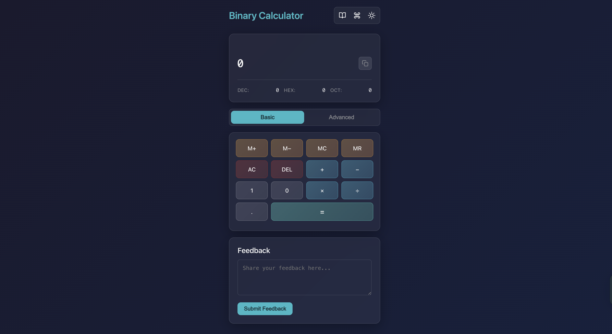

<h1 align='center'>Binary-Calculator</h1>

Simple Binary Calculator using HTML, CSS, and JavaScript  
### Preview:

### Note:
Please Create an issue first then make pull request if you have any suggestion or bug report.

### How to contribute  

* Star this repository.
* Create an issue with description that how you want to contribute in this project.
* Then fork this repository.
* In forked repository add your changes.
* Then make pull request with issue number.
* Wait for review.

Web link - https://alitindrawan24.github.io/Binary-Calculator/
  

## Contributors:

